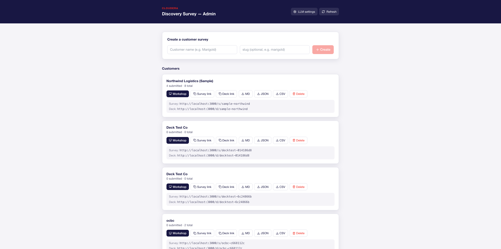
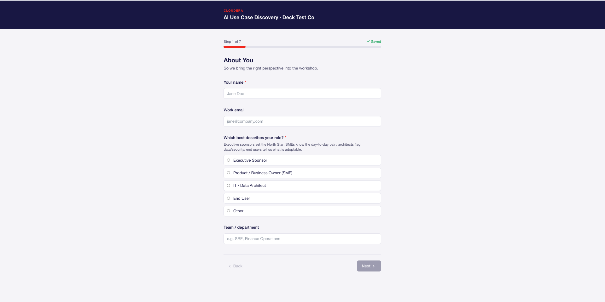
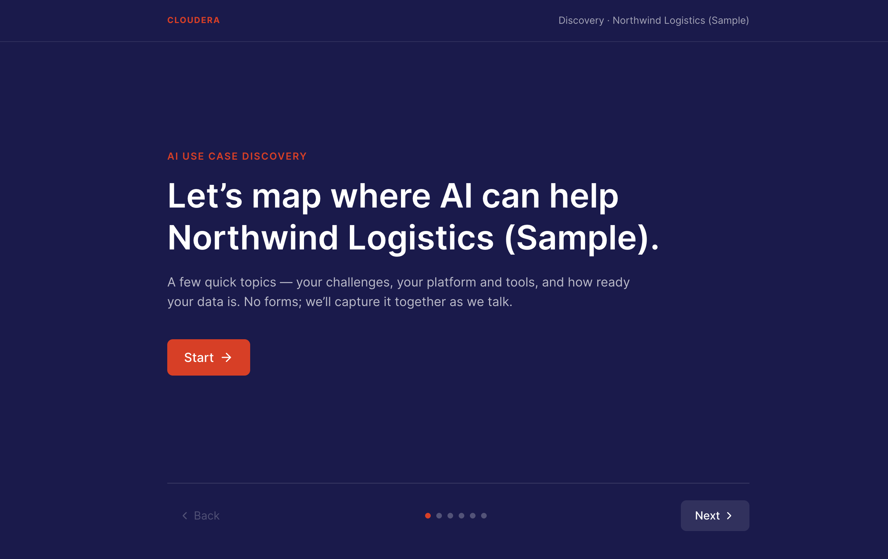
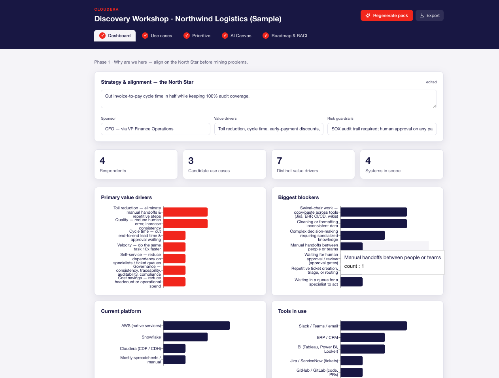
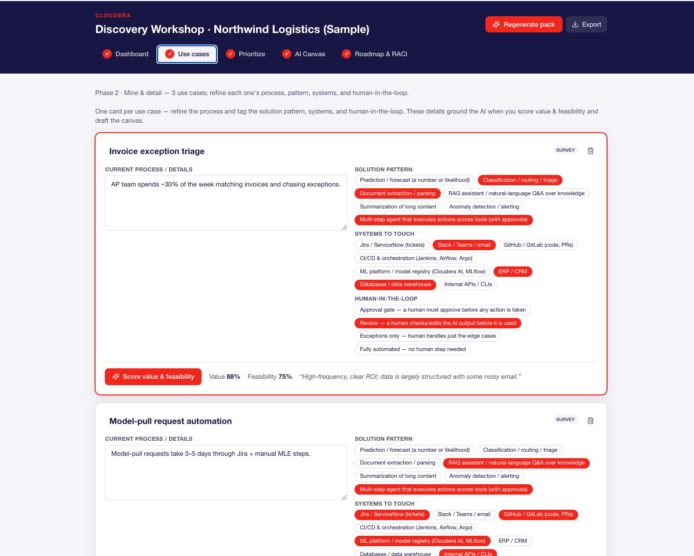
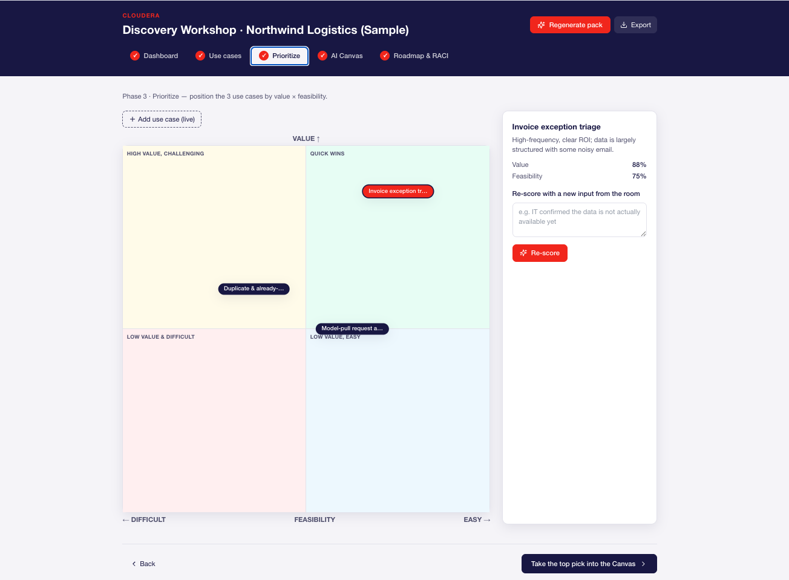
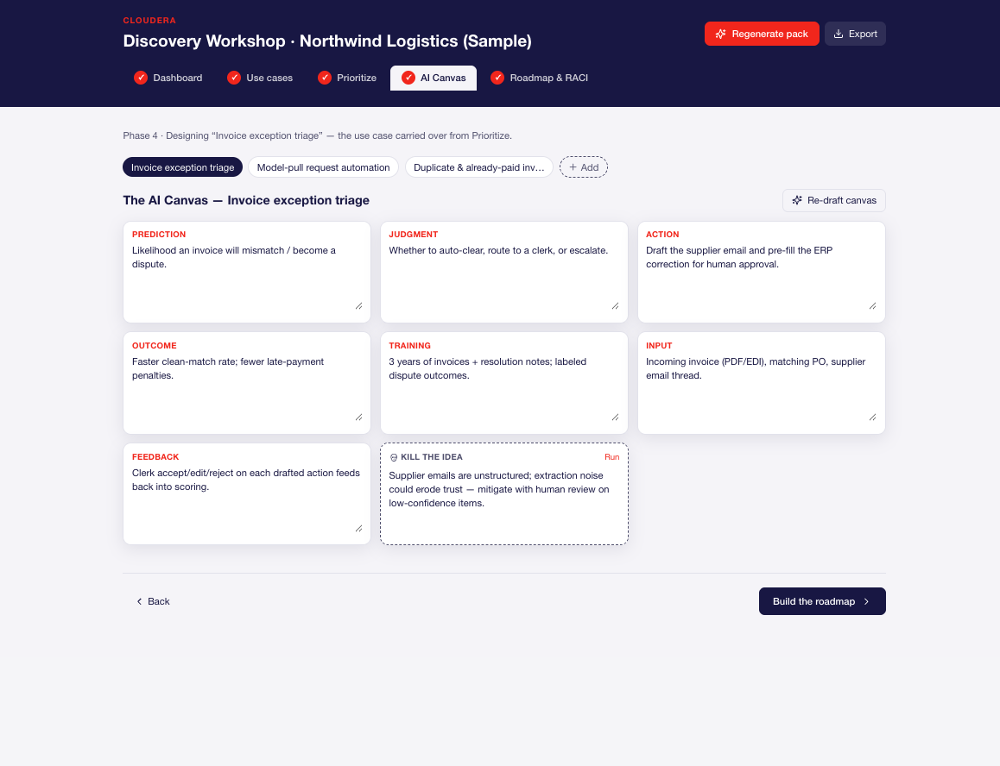
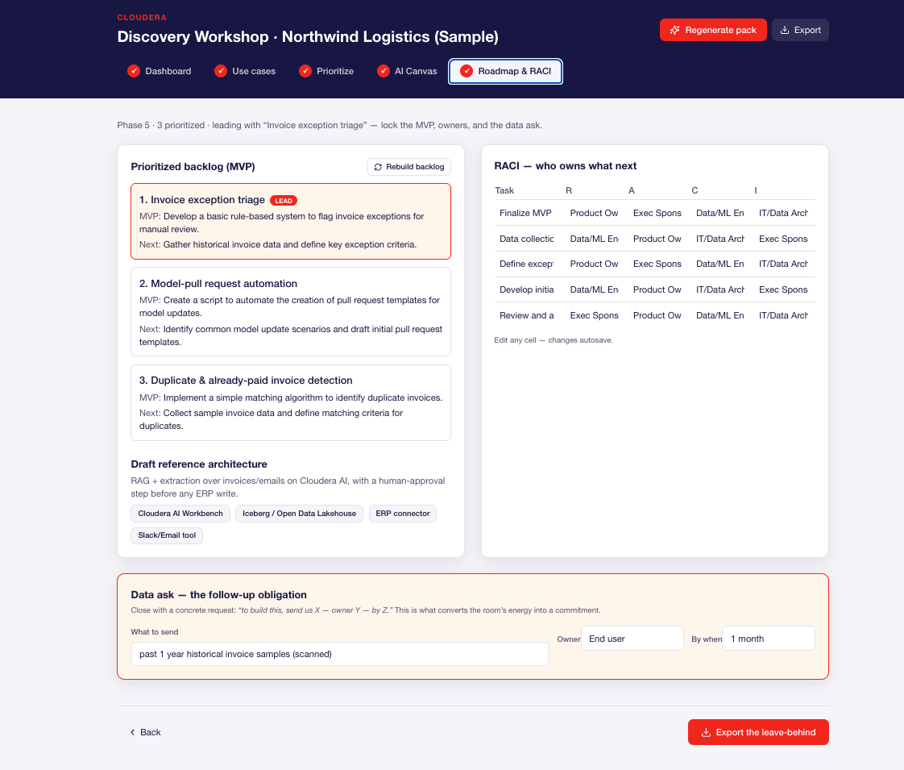

# AI Use Case Discovery — Pre-Discovery Survey

A shareable web survey that feeds the Cloudera **AI Use Case Discovery Workshop**. It turns the
deck's "Pre-Discovery Homework" (Identify the Friction, Data & Tooling Readiness, Strategic Impact,
Blue Sky, candidate use cases) into a link you send to customer stakeholders — and collects their
answers into per-customer **catalogs** (Markdown / JSON / CSV).

- **Customer-accessible** — an unguessable `/s/<customer>-xxxx` link, no login. Autosaves and resumes.
- **Reusable** — one deployment, many customers. The questionnaire is defined once in
  `lib/questionnaire.ts`; adding a customer needs zero code.
- **Catalog collection** — one click exports Markdown (workshop use-case tables + AI Canvas prefill),
  JSON (raw), and CSV (cross-customer Value-vs-Feasibility scoring).

## Screenshots — Stage 1 (survey + admin)

**Admin dashboard** — create/delete customers, see response counts, download catalogs, open the cockpit.



**Full survey** (`/s/<slug>`) — the complete pre-discovery questionnaire; autosaves and resumes per browser.



**Simplified deck-style survey** (`/d/<slug>`) — one punchy question-set per slide for a guided, sales-led walk-through.



## Stack
Next.js 14 (App Router) · TypeScript · TailwindCSS · **swappable datastore** (embedded SQLite by
default, Postgres optional). Ships as a **Docker image** and deploys either as a container or as a
**Cloudera AI (CML) Workbench Application**.

## Datastore — no external SaaS by default
The DB backend is chosen by environment (`lib/db/`):

| Env | Backend | Where data lives |
| --- | --- | --- |
| _(default, no `DATABASE_URL`)_ | **SQLite** (`better-sqlite3`) | A file at `SQLITE_PATH` — inside the container volume / Workbench project. No external processor. |
| `DATABASE_URL` set | **Postgres** (`pg`) | Your Postgres (e.g. a Cloudera-approved managed instance). |

Switching is config-only — no code change.

## Local development
```bash
npm install
cp .env.example .env.local          # set ADMIN_TOKEN (openssl rand -hex 24)
npm run migrate                      # creates tables (SQLite by default)
npm run dev                          # http://localhost:3000
```

## How to use it
1. Go to `/admin`, sign in with `ADMIN_TOKEN`.
2. **Create a customer** (e.g. "Marigold") → copy the generated `/s/marigold-9f3a…` link and send it.
3. Stakeholders fill it in — progress autosaves; they can close and resume; each person gets their
   own response.
4. In `/admin`, download the catalog as **MD / JSON / CSV**, or run
   `npm run export-catalog <slug>` to write files into `catalog/`.

## Deploy — Option 1: Docker (any approved host)
```bash
docker build -t ucd-survey .
docker run -p 8080:8080 \
  -e ADMIN_TOKEN="$(openssl rand -hex 24)" \
  -v ucd_data:/app/data \                # persist SQLite
  ucd-survey
# → http://localhost:8080   (add -e DATABASE_URL=... to use Postgres instead)
```
Deploys as-is to any container platform (Cloudera cloud, ECS/Cloud Run, Render, etc.). The image
listens on `PORT`/`CDSW_APP_PORT` (8080).

## Deploy — Option 2: Cloudera AI Workbench Application
See **`cai_integration/README.md`**. In short: point a CML Application at
`cai_integration/start-app.sh` with a Node 20+ runtime, set `ADMIN_TOKEN`, and keep unauthenticated
access **off** (SSO). For a git-backed one-command bootstrap (create project → build Job → deploy),
`cai_integration/{setup_project,create_jobs,trigger_jobs,deploy_application}.py` automate it via CML API v2.

## Security
- **Transport:** terminate TLS at your host/ingress (Vercel/CML/LB do this).
- **Admin auth:** shared `ADMIN_TOKEN` via `Authorization: Bearer` or the `admin_token` cookie —
  **never** in a URL (catalog downloads use authenticated fetch). Compared in constant time.
- **Survey links:** slugs carry an unguessable suffix; response tokens are 24 random bytes.
- **Abuse controls:** per-IP rate limiting on response create/patch; a 128 KB cap on stored answers.
- **CSV injection:** cells beginning with `= + - @` are neutralized.
- **Erasure:** `/admin` "Delete" (or `DELETE /api/surveys/<slug>`) removes a customer and cascades to
  all their responses.
- **PII collected:** name, work email, role + free-text business answers — treat as confidential.

### ⚠️ Governance (confirm before real customer data)
This stores **customer business information + personal data**. Before going live, confirm with
Cloudera's data-handling / procurement policy:
- **Host & account** — deploy under a **Cloudera-owned** account/environment, not personal infra.
- **Data region & DPA** — customers may require a specific region and a data-processing agreement.
- **Retention** — decide how long responses are kept; use the delete action to honor erasure requests.

Until confirmed, run only with **dummy/non-sensitive data** (a pilot).

## Stage 2 — On-site workshop cockpit
A facilitator-driven cockpit (projected on one screen) that turns the collected survey data into the
deck's live workshop artifacts. Open it from `/admin` (the **Workshop** button per customer) or go to
`/workshop/<slug>` and sign in with `ADMIN_TOKEN`.

- **Generate pack** runs a multi-agent pass (pre-session) over the submitted responses → scores each
  use case on the deck's rubric, drafts the 7-field AI Canvas, a reference architecture, and
  "kill-the-idea" notes, plus an MVP backlog + RACI.
- Four tabs: **Dashboard** (survey distributions) · **Prioritize** (draggable Value×Feasibility
  matrix) · **AI Canvas** (editable, per use case) · **Roadmap & RACI**. **Export** downloads a
  Markdown leave-behind.
- On-site, agents run only as **on-demand single-item assists** (re-score / re-draft / kill-idea).
- **Configure the LLM in-app** at `/admin/settings` (base URL / key / model + **Test connection**) —
  no redeploy needed. These DB settings override the `LLM_BASE_URL` / `LLM_API_KEY` / `LLM_MODEL`
  env vars. Any OpenAI-compatible endpoint (Cloudera AI Inference, vLLM, OpenAI).
- **Room-first / survey-optional:** if no survey was returned, use **Add use case (live)** on the
  Prioritize/Canvas tabs to capture use cases in the room, then run the assists. See
  `docs/SESSION_GUIDE.md`.
- **AI is optional:** with no LLM configured, the dashboard and all manual editing still work; only
  the agent buttons are disabled. The LLM key stays server-side.

### The cockpit, phase by phase

**Phase 1 · Dashboard** — align on the North Star (sponsor vision, value drivers, guardrails) and read the survey signal distributions before mining problems.



**Phase 2 · Use-case collection** — mine and detail each candidate use case (process steps, pattern, systems, human-in-the-loop); add live ones in the room.



**Phase 3 · Prioritize** — position use cases on the draggable Value × Feasibility matrix from the agent scores.



**Phase 4 · AI Canvas** — the editable 7-field canvas for the focus use case (prediction, judgment, action, outcome, training, input, feedback).



**Phase 5 · Roadmap & RACI** — MVP backlog, reference architecture, RACI, and the closing **data ask** (what to send, owner, by when). **Export** downloads the Markdown leave-behind.



## Routes
| Route | Who | Purpose |
| --- | --- | --- |
| `/s/[slug]` | Customer (public link) | The survey. Autosave + resume. |
| `/admin` | You (token) | Create/delete customers, view counts, download catalogs. |
| `POST /api/responses` | Public (rate-limited) | Start a response, returns a resume token. |
| `GET/PATCH /api/responses/[token]` | Public (rate-limited) | Load / autosave / submit. |
| `GET/POST /api/surveys` · `DELETE /api/surveys/[slug]` | Admin | List / create / delete customers. |
| `GET /api/catalog/[slug]?format=md\|json\|csv` | Admin | Export catalog. |
| `/workshop/[slug]` | You (token) | Stage-2 facilitator cockpit. |
| `GET/PATCH /api/workshop/[slug]` | Admin | Load / save the workshop pack. |
| `POST /api/workshop/[slug]/generate` | Admin | Run the multi-agent pre-bake pass. |
| `POST /api/workshop/[slug]/assist` | Admin | On-demand single-item agent assist. |

## Customizing the questionnaire
Edit `lib/questionnaire.ts` (types: `text`, `textarea`, `single`, `multi`, `scale`, plus `repeatable`
sections). The UI, autosave, and all three catalog formats derive from it automatically. To add a
field to the CSV, extend `CSV_FIELDS` in `lib/catalog.ts`.
